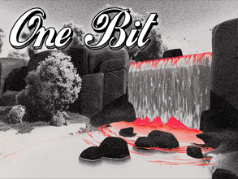
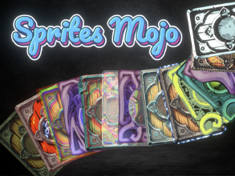
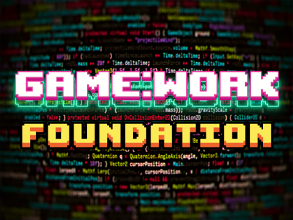
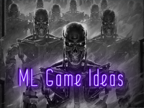
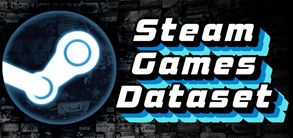
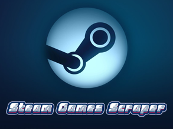

<h1 align="center">Hi , I'm Martin Bustos 
a indie game developer and asset store publisher
</h1>
<h3 align="center">
  
   
  
</h3>

### 🔭 I’m currently working on **assets** and a **game framework**

### 📝 I write articles on [my web](https://fronkongames.github.io/)

### 💬 Ask me about **game development** and **Unity** (**fronkongames@gmail.com**)

 

# Assets for Unity

<h3 align="right">
A hipster, original and versatile look using a dithering with blue noise
   
<a href="https://fronkongames.github.io/store/demos/one-bit/">DEMO</a> | <a href="https://www.youtube.com/watch?v=WY10wS39GDw">YOUTUBE</a> | <a href="https://assetstore.unity.com/packages/vfx/shaders/fullscreen-camera-effects/onebit-216000">STORE</a>
</h3>

  
    

<h3>

A collection of 2D effects to add more juice to your games
  
<a href="https://fronkongames.github.io/store/demos/sprites-mojo/">DEMO</a> | <a href="https://www.youtube.com/watch?v=4eyGdIvJxko">YOUTUBE</a> | <a href="https://assetstore.unity.com/packages/vfx/shaders/sprites-mojo-214468">STORE</a>

</h3>

    

  

# Game development

<h3>

A curated collection of resources to gamedev

</h3>

          

<h3>

Generic code and tools to build the basis of a framework to develop Unity based games

</h3>

    

  

# Fun

<h3>

Go is a very old strategy game that consists of capturing pieces and winning territories

</h3>

         

<h3>

Using neural networks built with Keras / Tensorflow and using over 70000 Steam game descriptions

</h3>

       

<h3>

The largest dataset with information on games published on Steam

</h3>

     

<h3>

Extract information from all games published in Steam thanks to its Web API, and store it in JSON format

</h3>

     

  

# Technologies and Tools

  
  
  
  <a href="https://unity.com/" target="_blank" rel="noreferrer"> 
  
  
  
  
  <a href="https://www.jetbrains.com/rider/" target="_blank" rel="noreferrer"> 
  <a href="https://code.visualstudio.com/" target="_blank" rel="noreferrer"> 
  

  

