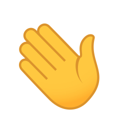

<h1 align="center">Hi , I'm Martin Bustos 
a indie game developer and asset store publisher
</h1>
<h3 align="center">
  
   
  
</h3>

### 🔭 I am currently working on a [zombie card game](https://fronkongames.github.io/Dawn-Of-The-Cards/), a [framework for game development](https://github.com/FronkonGames/GameWork-Foundation) and [assets for Unity](https://assetstore.unity.com/publishers/62716).
### 📝 I write articles on [my web](https://fronkongames.github.io/).
### 💬 Ask me about **game development** and **Unity** (**fronkongames@gmail.com**).

 
