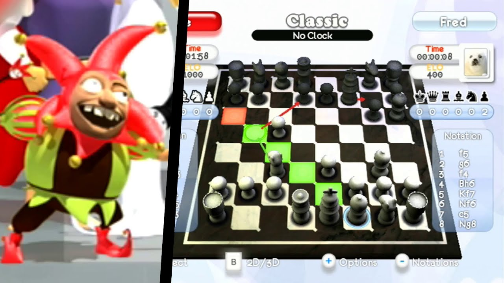
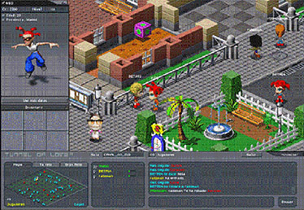

 :telescope: I am currently working on a [zombie card game](https://fronkongames.github.io/Dawn-Of-The-Cards/), a [framework for game development](https://github.com/FronkonGames/GameWork-Foundation) and [assets for Unity](https://assetstore.unity.com/publishers/62716).
##  📝 I write articles on [my web](https://fronkongames.github.io/).
##  💬 Ask me about **game development** and **Unity** (**fronkongames@gmail.com**).

 

## Game Development

* **Game:Work**, a framework to develop Unity based games.
  * **[Foundation](https://github.com/FronkonGames/GameWork-Foundation)**: architecture-agnostic code and tools.
  * **[Core](https://github.com/FronkonGames/GameWork-Core)**: a micro-kernel framework with dependency injection and event-driven communication.
  * Modules:
    * **[Local Data](https://github.com/FronkonGames/GameWork-Local-Data)**: async load/save local data with compression, encryption and integrity check.
    * **[Scene](https://github.com/FronkonGames/GameWork-Scene)**: async scene loading management module.
    * **[Tween](https://github.com/FronkonGames/GameWork-Tween)**: tween / easing module.

* **[Awesome GameDev](https://github.com/FronkonGames/Awesome-Gamedev)**, a curated collection of resources to gamedev.
* **[Steam Games Dataset](https://www.kaggle.com/datasets/fronkongames/steam-games-dataset)**, the largest dataset with information on games published on Steam.
* **[Design Patterns In Game Development](https://github.com/FronkonGames/GameWork-Foundation)**, a tutorial on the use of Design Patterns in videogames.

* **Twitter Bots**, related to game development.
  * **[One Game Idea A Day](https://twitter.com/OneGameIdeaADa1)**, generates game ideas using Machine Learning.
  * **[Game Development Daily News](https://twitter.com/daily_unity)**, news, resources and job offers about game development (and its [Spanish version](https://twitter.com/MenendevBot)).
  * **[Unity Store Deals](https://twitter.com/UnityStoreDeals)**, searches for all asset offers in the Unity Store.
  * **[Cant Refuse Offer](https://twitter.com/CantRefuseOffer)**, Unity Store assets with good ratings and offers.

## Assets for Unity

* **Artistic Bundle**, anhance your creativity and get a unique style with this effects bundle.
  * **[One Bit](https://assetstore.unity.com/packages/vfx/shaders/fullscreen-camera-effects/artistic-one-bit-216000)**, a hipster, original and versatile look using a dithering with blue noise ([demo](https://fronkongames.github.io/store/demos/onebit/), [youtube](https://www.youtube.com/watch?v=Yz9j7iXuDhY)).
  * **[Sprites Mojo](https://fronkongames.github.io/store/sprites-mojo.html)**, a collection of 2D effects to add more juice to your games ([demo](https://fronkongames.github.io/store/demos/sprites-mojo/), [youtube](https://www.youtube.com/watch?v=4eyGdIvJxko)).

* **Spice Up Bundle**, a large selection of effects to give juice to your FPS / VR games.
  * **[Damage](https://assetstore.unity.com/packages/vfx/shaders/fullscreen-camera-effects/spice-up-damage-247019)**, a visual indicator of health and damage received (<a href="https://fronkongames.github.io/store/demos/damage/">demo</a>, <a href="https://www.youtube.com/watch?v=rChUFliVX_E">youtube</a>).
  * **[Drunk](https://assetstore.unity.com/packages/vfx/shaders/fullscreen-camera-effects/spice-up-drunk-247929)**, now you can let players know that they are drinking too much (<a href="https://fronkongames.github.io/store/demos/drunk/">demo</a>, <a href="https://www.youtube.com/watch?v=L7agg4NP7XU">youtube</a>).
  * **[Stoned](https://assetstore.unity.com/packages/vfx/shaders/fullscreen-camera-effects/spice-up-stoned-248596)**, too many potions of questionable origin? This asset simulates any of its effects! (<a href="https://fronkongames.github.io/store/demos/stoned/">demo</a>, <a href="https://www.youtube.com/watch?v=5f_TMTkHXM0">youtube</a>).
  * **[Frozen](https://assetstore.unity.com/packages/vfx/shaders/fullscreen-camera-effects/spice-up-frozen-249207)**, experience a realistic and immersive freezing effect (<a href="https://fronkongames.github.io/store/demos/frozen/">demo</a>, <a href="https://www.youtube.com/watch?v=5f_TMTkHXM0">youtube</a>).
  * **[Speed Lines](https://assetstore.unity.com/packages/slug/250408)**, anime speed lines (<a href="https://fronkongames.github.io/store/demos/speedlines/">demo</a>, <a href="https://www.youtube.com/watch?v=KfDiwLYM6xw">youtube</a>).
  * **[Blurry](https://assetstore.unity.com/packages/vfx/shaders/fullscreen-camera-effects/spice-up-blurry-251642)**, blurred vision based on previous frames (<a href="https://fronkongames.github.io/store/demos/blurry/">demo</a>, <a href="https://www.youtube.com/watch?v=izte-BmU-nw">youtube</a>).
  * **[Double Vision](https://assetstore.unity.com/packages/vfx/shaders/fullscreen-camera-effects/spice-up-double-vision-252006)**, dual vision effect with steroids (<a href="https://fronkongames.github.io/store/demos/doublevision/">demo</a>, <a href="https://www.youtube.com/watch?v=FPELiWUmtw4">youtube</a>).
  * **[Rain](https://assetstore.unity.com/packages/vfx/shaders/fullscreen-camera-effects/spice-up-rain-252460)**, simulates the raindrops on the screen ([demo](https://fronkongames.github.io/store/demos/rain/), [youtube](https://www.youtube.com/watch?v=DKMAa_LY7yU)).
  * **[Ghost Vision](https://assetstore.unity.com/packages/vfx/shaders/fullscreen-camera-effects/spice-up-ghost-vision-252730)**, the vision of strange creatures ([demo](https://fronkongames.github.io/store/demos/ghostvision/), [youtube](https://www.youtube.com/watch?v=NyqkpzdqkNU)).
  * **[Scanner](https://assetstore.unity.com/packages/vfx/shaders/fullscreen-camera-effects/spice-up-scanner-253706)**, cameras, monitors and robots ([demo](https://fronkongames.github.io/store/demos/scanner/), [youtube](https://www.youtube.com/watch?v=cudFCcHb_HY)).
  * **[Death Screen](https://assetstore.unity.com/packages/vfx/shaders/fullscreen-camera-effects/spice-up-death-screen-254360)**, the last screen ([demo](https://fronkongames.github.io/store/demos/deathscreen/), [youtube](https://www.youtube.com/watch?v=ewXstV38FWc)).
  * **[Purkinje](https://assetstore.unity.com/packages/vfx/shaders/fullscreen-camera-effects/spice-up-purkinje-255525)**, night scenes, as seen by the human eye ([demo](https://fronkongames.github.io/store/demos/purkinje/), [youtube](https://www.youtube.com/watch?v=FGC6LDY1RGg)).
  * **[Broken Screen](https://assetstore.unity.com/packages/vfx/shaders/fullscreen-camera-effects/spice-up-broken-screen-256124)**, real-time glass fractures ([demo](https://fronkongames.github.io/store/demos/brokenscreen/), [youtube](https://www.youtube.com/watch?v=eqaPjR1KYPg)).
  * **[Pulse](https://assetstore.unity.com/packages/slug/257920)**, focus on one point on the screen ([demo](https://fronkongames.github.io/store/demos/pulse/), [youtube](https://www.youtube.com/watch?v=63-RWxded2A)).
  * **[Shake](https://assetstore.unity.com/packages/slug/258721)**, like in an earthquake! ([demo](https://fronkongames.github.io/store/demos/shake/), [youtube](https://www.youtube.com/watch?v=5Zc_0_BYOVw)).
  * **[Night Vision](https://assetstore.unity.com/packages/slug/259563)**, the most versatile, configurable and economical solution for your night vision effects ([demo](https://fronkongames.github.io/store/demos/nightvision/), [youtube](https://www.youtube.com/watch?v=7Dam3W04TzU)).
  * **[BodyCam](https://assetstore.unity.com/packages/slug/260035)**, like the one used by police officers, perfect for FPS ([demo](https://fronkongames.github.io/store/demos/bodycam/), [youtube](https://www.youtube.com/watch?v=pBp_WXNzlTY)).
  * **[Lens Flare](https://assetstore.unity.com/packages/slug/261769)**, easy to use and with many settings ([demo](https://fronkongames.github.io/store/demos/lensflare/), [youtube](https://www.youtube.com/watch?v=9Z6wVV6XXPk)).

* **[Retro Bundle](https://assetstore.unity.com/packages/vfx/shaders/fullscreen-camera-effects/retro-bundle-245493)**, a great collection of retro effects, simple to use and with many configuration options (<a href="https://www.youtube.com/watch?v=FPn7dk3fkG4">youtube</a>).
  * **[ASCII](https://assetstore.unity.com/packages/vfx/shaders/fullscreen-camera-effects/retro-ascii-241924)**, the old-school ASCII effect with steroids! (<a href="https://fronkongames.github.io/store/demos/ascii/">demo</a>, <a href="https://www.youtube.com/watch?v=shQxDDe8Aw4">youtube</a>).
  * **[CRT TV](https://assetstore.unity.com/packages/vfx/shaders/fullscreen-camera-effects/retro-crt-tv-241411)**, makes your game look like on an old television (<a href="https://fronkongames.github.io/store/demos/crttv/">demo</a>, <a href="https://www.youtube.com/watch?v=UFFvtpXdUBc">youtube</a>).
  * **[Old Films](https://assetstore.unity.com/packages/vfx/shaders/fullscreen-camera-effects/retro-spectrum-239827)**, the best way to replicate the look of old movies (<a href="https://fronkongames.github.io/store/demos/oldfilms/">demo</a>, <a href="https://www.youtube.com/watch?v=zBwXR_i6_gw">youtube</a>).
  * **[Spectrum](https://assetstore.unity.com/packages/vfx/shaders/fullscreen-camera-effects/retro-spectrum-239827)**, mimics the legendary ZX Spectrum 8-bits computer from 1982 (<a href="https://fronkongames.github.io/store/demos/spectrum/">demo</a>, <a href="https://www.youtube.com/watch?v=SdXHXljClF8">youtube</a>).
  * **[Handheld 8-Bit](https://assetstore.unity.com/packages/vfx/shaders/fullscreen-camera-effects/retro-handheld-8-bit-239924)**, imitates the graphics of the 8-bit handheld console Game Boy (<a href="https://fronkongames.github.io/store/demos/handheld8bit/">demo</a>, <a href="https://www.youtube.com/watch?v=j6vOE1nazbA">youtube</a>).
  * **[Vintage Filters](https://assetstore.unity.com/packages/vfx/shaders/fullscreen-camera-effects/retro-vintage-filters-242600)**, a great collection of vintage filters inspired by Instagram effects (<a href="https://fronkongames.github.io/store/demos/vintagefilters/">demo</a>, <a href="https://www.youtube.com/watch?v=YXMNQn7cu8I">youtube</a>).
  * **[Old Computers](https://assetstore.unity.com/packages/vfx/shaders/fullscreen-camera-effects/retro-old-computers-243911)**, emulates the color palettes of old 8-bit and 16-bit computers (<a href="https://fronkongames.github.io/store/demos/oldcomputers/">demo</a>, <a href="https://www.youtube.com/watch?v=_gADYOdLbL4">youtube</a>).
  * **[VHS](https://assetstore.unity.com/packages/slug/244944)**, mimic VHS as true as possible (<a href="https://fronkongames.github.io/store/demos/vhs/">demo</a>, <a href="https://www.youtube.com/watch?v=LH9KDnOq0dg">youtube</a>).

## Fun

* **[ML Game Ideas](https://github.com/FronkonGames/Machine-Learning-Game-Ideas)**, using neural networks built with Keras / Tensorflow and using over 74000 Steam game descriptions.
* **[Steam Games Scraper](https://github.com/FronkonGames/Steam-Games-Scraper)**, extract information from all games published in Steam thanks to its Web API, and store it in JSON format.
* **[Go](https://fronkongames.github.io/blog/go-weiqi-igo-baduk.html)**, a very old strategy game that consists of capturing pieces and winning territories.

## Games published

  
<b>Powernauts (Android, iOS)</b>, Teachlabs, CTO / Lead Game Programmer.

  <table>
    <tr>
      <th><a href="https://www.youtube.com/watch?v=9cTPSxZqZfY"></img></a></th>
      <th></th>
      <th></th>
    </tr>
  </table>

  
<b>Motorama (Steam)</b>, Freedom Factory Studios, CTO / Lead Game Programmer.

  <table>
    <tr>
      <th><a href="https://www.youtube.com/watch?v=I_RbagXOpXk"></img></a></th>
      <th></th>
      <th></th>
      <th></th>
      <th></th>
    </tr>
  </table>

  
<b>Naraba World (PC, Nintendo DS)</b>, Freedom Factory Studios, CTO / Lead Game Programmer.

  <table>
    <tr>
      <th><a href="https://www.youtube.com/watch?v=bF5DJOQkFPE"></img></a></th>
      <th></th>
      <th></th>
      <th></th>
      <th></th>
    </tr>
  </table>

  
<b>Baobab Planet (PC, Online)</b>, Freedom Factory Studios, CTO / Lead Game Programmer.

  <table>
    <tr>
      <th><a href="https://www.youtube.com/watch?v=yXq3sCn2cjQ"></img></a></th>
      <th></th>
      <th></th>
      <th></th>
    </tr>
  </table>

  
<b>Brico Party aka Fix It (PC, Wii, Nintendo DS)</b>, Freedom Factory Studios, CTO / Lead Game Programmer.

  <table>
    <tr>
      <th><a href="https://www.youtube.com/watch?v=9j_7w6CLmjE"></img></a></th>
      <th></th>
      <th></th>
      <th></th>
    </tr>
  </table>

  
<b>Fritz Chess (PC, Wii, PS3)</b>, Freedom Factory Studios, CTO / Lead Game Programmer.

  <table>
    <tr>
      <th></th>
      <th></th>
      <th></th>
      <th></th>
    </tr>
  </table>

  
<b>Cycling Evolution aka Radsport Evolution (PC)</b>, Freedom Factory Studios, CTO / Lead Game Programmer.

  <table>
    <tr>
      <th><a href="https://www.youtube.com/watch?v=IsHRIYzHxFo"></img></a></th>
      <th></th>
      <th></th>
      <th></th>
    </tr>
  </table>

  
<b>Zed City (PC, Online)</b>, Play Wireless, Lead Game Programmer.

  <table>
    <tr>
      <th><a href="https://www.youtube.com/watch?v=b7MHK6iD2_0"></img></a></th>
      <th></th>
      <th></th>
      <th></th>
      <th></th>
      <th></th>
    </tr>
  </table>

  
<b>Summer / Winter Battle (PC, Online)</b>, Bety Byte / Coca Cola, Game programmer and Tools.

  <table>
    <tr>
      <th></th>
      <th></th>
      <th></th>
    </tr>
  </table>

  
<b>Hurakan Condor (PC, Online)</b>, Bety Byte / Port Aventura, Coca Cola, Game programmer and Tools.

  <table>
    <tr>
      <th></th>
    </tr>
</table>

  
<b>Acción Rescate (PC)</b>, Bety Byte / Bimbo, Game programmer and Tools.

  <table>
    <tr>
      <th></th>
      <th></th>
      <th></th>
      <th></th>
      <th></th>
    </tr>
  </table>

  
<b>Futbol 11 (PC, Online)</b>, Bety Byte / Coca Cola, Game programmer and Tools.

  <table>
    <tr>
      <th></th>
      <th></th>
    </tr>
  </table>

  
<b>Universal Mediterránea (PC)</b>, Bety Byte / Universal Warner Bros, Game programmer and Tools.

  <table>
    <tr>
      <th></th>
    </tr>
  </table>

  
<b>Tunnel Of Love (PC, Online)</b>, Bety Byte / Coca Cola, Game programmer and Tools.

  <table>
    <tr>
      <th></th>
      <th></th>
      <th></th>
    </tr>
  </table>

  
<b>PC Fútbol 2001 (PC)</b>, Dinamic Multimedia, Game programmer and 3DSMax Tools.

  <table>
    <tr>
      <th></th>
      <th></th>
      <th></th>
      <th></th>
    </tr>
  </table>

## Technologies And Tools

  
  
  
  <a href="https://unity.com/" target="_blank" rel="noreferrer"> 
  
  
  
  
  <a href="https://www.jetbrains.com/rider/" target="_blank" rel="noreferrer"> 
  <a href="https://code.visualstudio.com/" target="_blank" rel="noreferrer"> 
  

  

