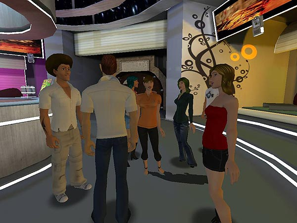
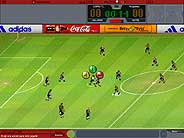

<h1 align="center">Hi , I'm Martin Bustos 
a indie game developer and asset store publisher
</h1>
<h3 align="center">
  
   
  
</h3>

### 🔭 I’m currently working on **assets** and a **game framework**

### 📝 I write articles on [my web](https://fronkongames.github.io/)

### 💬 Ask me about **game development** and **Unity** (**fronkongames@gmail.com**)

 

## Assets for Unity

* **[One Bit](https://fronkongames.github.io/store/one-bit.html)**, a hipster, original and versatile look using a dithering with blue noise (<a href="https://fronkongames.github.io/store/demos/one-bit/">demo</a>, <a href="https://www.youtube.com/watch?v=WY10wS39GDw">youtube</a> , <a href="https://assetstore.unity.com/packages/vfx/shaders/fullscreen-camera-effects/onebit-216000">store</a>).
* **[Sprites Mojo](https://fronkongames.github.io/store/sprites-mojo.html)**, a collection of 2D effects to add more juice to your games (<a href="https://fronkongames.github.io/store/demos/sprites-mojo/">demo</a>, <a href="https://www.youtube.com/watch?v=4eyGdIvJxko">youtube</a>, <a href="https://assetstore.unity.com/packages/vfx/shaders/sprites-mojo-214468">store</a>).

## Game Development

* **[Awesome GameDev](https://github.com/FronkonGames/Awesome-Gamedev)**, a curated collection of resources to gamedev.
* **Game:Work**, a modular framework with dependency injection to develop Unity based games.
  * **[Foundation](https://github.com/FronkonGames/GameWork-Foundation)**: generic code and tools.
  * **[Core](https://github.com/FronkonGames/GameWork-Core)**: modules, events and DI.
  * Modules.
    * **[Scene](https://github.com/FronkonGames/GameWork-Scene-Module)**: async scene loading management module.
    * **[Tween](https://github.com/FronkonGames/GameWork-Tween-Module)**: tween / easing module.
    * **[AI](https://github.com/FronkonGames/GameWork-AI-Module)**: algorithms, structures and tools for AI.
    * **[Data Persistence](https://github.com/FronkonGames/GameWork-Data-Persistence)**: data persistence.
* **[Design Patterns In Game Development](https://github.com/FronkonGames/GameWork-Foundation)**, a tutorial on the use of Design Patterns in videogames.
* **[Game Development Daily News](https://twitter.com/daily_unity)**, a Twitter bot with news, resources and job offers about game development (and its [Spanish version](https://twitter.com/MenendevBot)).
* **[Unity Store Deals](https://twitter.com/UnityStoreDeals)**, a Twitter bot that searches for all asset offers in the Unity store.

## Fun

* **[ML Game Ideas](https://github.com/FronkonGames/Machine-Learning-Game-Ideas)**, using neural networks built with Keras / Tensorflow and using over 70000 Steam game descriptions.
* **[Steam Games Dataset](https://www.kaggle.com/datasets/fronkongames/steam-games-dataset)**, the largest dataset with information on games published on Steam.
* **[Steam Games Scraper](https://github.com/FronkonGames/Steam-Games-Scraper)**, extract information from all games published in Steam thanks to its Web API, and store it in JSON format.
* **[One Game Idea A Day](https://twitter.com/OneGameIdeaADa1)**, a Twitter bot that generates game ideas using Machine Learning.
* **[Go](https://fronkongames.github.io/blog/go-weiqi-igo-baduk.html)**, a very old strategy game that consists of capturing pieces and winning territories.

## Games

* **Fritz Chess (PC, Wii, PS3)**, Freedom Factory Studios, CTO / Lead Game Programer.

<table>
  <tr>
    <th></th>
    <th></th>
    <th></th>
    <th></th>
  </tr>
</table>

* **Cycling Evolution (PC)**, Freedom Factory Studios, CTO / Lead Game Programer.

<table>
  <tr>
    <th></th>
    <th></th>
    <th></th>
  </tr>
</table>

* **Zed City (PC, Online)**, Play Wireless, Lead Game Programer.

<table>
  <tr>
    <th></th>
    <th></th>
    <th></th>
    <th></th>
    <th></th>
  </tr>
</table>

* **Summer / Winter Battle (PC, Online)**, Bety Byte / Coca Cola, Game programmer and Tools.

<table>
  <tr>
    <th></th>
    <th></th>
    <th></th>
  </tr>
</table>

* **Hurakan Condor**, Bety Byte / Port Aventura, Coca Cola, Game programmer and Tools.

<table>
  <tr>
    <th></th>
  </tr>
</table>

* **Acción Rescate (PC)**, Bety Byte / Bimbo, Game programmer and Tools.

<table>
  <tr>
    <th></th>
    <th></th>
    <th></th>
    <th></th>
    <th></th>
  </tr>
</table>

* **Futbol 11 (PC, Online)**, Bety Byte / Coca Cola, Game programmer and Tools.

<table>
  <tr>
    <th></th>
    <th></th>
  </tr>
</table>

* **Universal Mediterránea (PC)**, Bety Byte / Universal Warner Bros, Game programmer and Tools.

<table>
  <tr>
    <th></th>
  </tr>
</table>

* **Tunnel Of Love (PC, Online)**, Bety Byte / Coca Cola, Game programmer and Tools.

<table>
  <tr>
    <th></th>
    <th></th>
    <th></th>
  </tr>
</table>

* **PC Fútbol 2001 (PC)**, Dinamic Multimedia, Game programmer and 3DSMax Tools.

<table>
  <tr>
    <th></th>
    <th></th>
    <th></th>
    <th></th>
  </tr>
</table>

## Technologies And Tools

  
  
  
  <a href="https://unity.com/" target="_blank" rel="noreferrer"> 
  
  
  
  
  <a href="https://www.jetbrains.com/rider/" target="_blank" rel="noreferrer"> 
  <a href="https://code.visualstudio.com/" target="_blank" rel="noreferrer"> 
  

  

