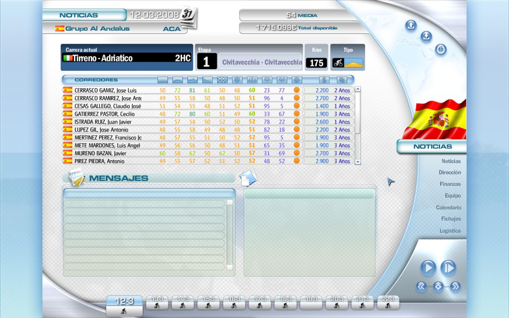
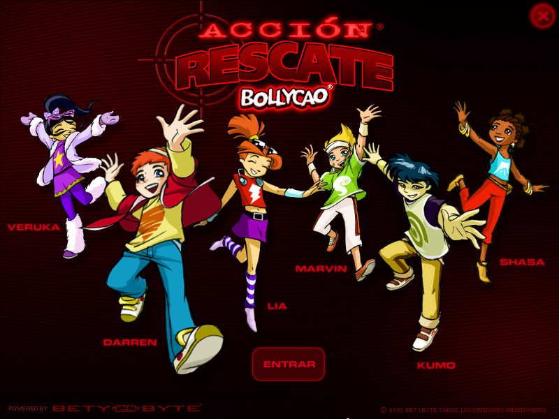

# Hi there, I'm Martin Bustos 👋

a game developer with over 25+ years of experience crafting games and tools for Unity developers

  

* :telescope: I am currently working on a [zombie card game](https://fronkongames.github.io/projects/kairos/), a [framework for game development](https://github.com/FronkonGames/GameWork-Foundation) and [assets for Unity](https://assetstore.unity.com/publishers/62716).
* :memo: I write articles on [my web](https://fronkongames.github.io/).
* :speech_balloon: Ask me about **game development** and **Unity** (**fronkongames@gmail.com**).

## Game Development

* **Game:Work**, a framework to develop Unity based games.
  * **[Foundation](https://github.com/FronkonGames/GameWork-Foundation)**: architecture-agnostic code and tools.
  * **[Core](https://github.com/FronkonGames/GameWork-Core)**: a micro-kernel framework with dependency injection and event-driven communication.
  * Modules:
    * **[Local Data](https://github.com/FronkonGames/GameWork-Local-Data)**: async load/save local data with compression, encryption and integrity check.
    * **[Scene](https://github.com/FronkonGames/GameWork-Scene)**: async scene loading management module.
    * **[Tween](https://github.com/FronkonGames/GameWork-Tween)**: tween / easing module.
* **Tools**, utilities for video game development.
  * **[Tiny Tweens](https://gist.github.com/FronkonGames/ae3d0d613ac4ea6738e288c0a490c020)**: a complete and easy to use Tweens library in one file.
  * **[Build History](https://github.com/FronkonGames/Build-History)**: keep a history of all the builds you do.
  * **[Palette Tool](https://github.com/FronkonGames/Palette-Tool)**: a tool for finding the perfect color palette.
  * **[Code Wizard](https://github.com/FronkonGames/Code-Wizard)**: generation of customizable code templates for Unity.
  * **[Tailwind](https://gist.github.com/FronkonGames/d8177d92b50ca29d346585b5a63361a2)**: an expertly-crafted color palette out-of-the-box, for Unity.
  * **[Before Commit](https://marketplace.visualstudio.com/items?itemName=FronkonGames.before-commit)** highlights files that exceed a configurable size limit in the Source Control view before committing them.
* **Datasets**, related to video game development.
  * **Steam Games Dataset** ([huggingface](https://huggingface.co/datasets/FronkonGames/steam-games-dataset), [kaggle](https://www.kaggle.com/datasets/fronkongames/steam-games-dataset)), the largest dataset with information on games published on Steam.
  * **Global Game Jam Dataset** ([huggingface](https://huggingface.co/datasets/FronkonGames/Global-Game-Jam-Dataset), [kaggle](https://www.kaggle.com/datasets/fronkongames/global-game-jam-dataset)), information about games and participants of the '[Global Game Jam](https://globalgamejam.org/)'.
* **Articles**.
  * **[Awesome GameDev](https://github.com/FronkonGames/Awesome-Gamedev)**, a curated collection of resources to game development.
  * **[Unity Is A Harsh Mistress 💔](https://fronkongames.github.io/blog/unity-is-a-harsh-mistress)**, a calm analysis of Unity's latest business plans and a conclusion.
  * **[Design Patterns In Game Development](https://github.com/FronkonGames/GameWork-Foundation)**, a tutorial on the use of Design Patterns in game development.
  * **[Introduction To Go](https://fronkongames.github.io/blog/introduction-to-go)**, the oldest board game still played today.
* **Social Bots**, related to game development.
  * **Game Development Daily News**, resources, news, and job offers about game development ([bsky](https://bsky.app/profile/gamedevdaily.bsky.social), [x](https://twitter.com/daily_unity)).
    * Spanish version ([bsky](https://bsky.app/profile/developeznews.bsky.social), [x](https://twitter.com/MenendevBot)).
  * **Unity Store Deals**, searches for all asset offers in the Unity Store ([bsky](https://bsky.app/profile/unitystoredeals.bsky.social), [x](https://twitter.com/Nephasto)).
  * **Cant Refuse Offer**, Unity Store assets with good ratings and offers ([bsky](https://bsky.app/profile/cantrefuseoffer.bsky.social), [x](https://twitter.com/CantRefuseOffer)).

## Assets for Unity

* **[True Ballistics](https://assetstore.unity.com/packages/templates/systems/true-ballistics-326593)**, a physically-accurate ballistics simulation ([youtube](https://www.youtube.com/watch?v=44zTW3yJL-Y)).

* **[Camera Transitions](https://assetstore.unity.com/packages/vfx/shaders/fullscreen-camera-effects/camera-transitions-293650)**, a collection of cinematic, realtime and easy-to-use camera transition effects.

* **[Artistic Bundle](https://assetstore.unity.com/packages/vfx/shaders/fullscreen-camera-effects/artistic-bundle-272266)**, enhance your creativity and get a unique style with this effects bundle.
  * **[Oil Paint](https://assetstore.unity.com/packages/vfx/shaders/fullscreen-camera-effects/artistic-oil-paint-264134)**, transform your games into pieces of art ([demo](https://fronkongames.github.io/demos-artistic/oilpaint/), [youtube](https://www.youtube.com/watch?v=A9jtFpXo02Q)).
  * **[One Bit](https://assetstore.unity.com/packages/vfx/shaders/fullscreen-camera-effects/artistic-one-bit-216000)**, a hipster, original and versatile look using a dithering with blue noise ([demo](https://fronkongames.github.io/demos-artistic/onebit/), [youtube](https://www.youtube.com/watch?v=Yz9j7iXuDhY)).
  * **[Tilt Shift](https://assetstore.unity.com/packages/vfx/shaders/fullscreen-camera-effects/artistic-tilt-shift-265465)**, tilt-shift style miniature scene ([demo](https://fronkongames.github.io/demos-artistic/tiltshift/), [youtube](https://www.youtube.com/watch?v=ixqjMNnUSus)).
  * **[Photo](https://assetstore.unity.com/packages/vfx/shaders/fullscreen-camera-effects/artistic-photo-315961)**, a versatile film camera simulator ([demo](https://fronkongames.github.io/demos-artistic/photo/), [youtube](https://www.youtube.com/watch?v=LPs97XIfQTE)).
  * **[Color Isolation](https://assetstore.unity.com/packages/vfx/shaders/fullscreen-camera-effects/artistic-color-isolation-266086)**, isolates areas by color and applies effects ([demo](https://fronkongames.github.io/demos-artistic/colorisolation/), [youtube](https://www.youtube.com/watch?v=XfHdKU1qTF4)).
  * **[Sharpen](https://assetstore.unity.com/packages/vfx/shaders/fullscreen-camera-effects/artistic-sharpen-266728)**, vibrant details, crisp images ([demo](https://fronkongames.github.io/demos-artistic/sharpen/), [youtube](https://www.youtube.com/watch?v=Xjax-orCmVY)).
  * **[Tonemapper](https://assetstore.unity.com/packages/vfx/shaders/fullscreen-camera-effects/artistic-tonemapper-267617)**, maps HDR into LDR using different algorithms ([demo](https://fronkongames.github.io/demos-artistic/tonemapper/), [youtube](https://www.youtube.com/watch?v=XcLXlvqG5yU)).
  * **[Comic](https://assetstore.unity.com/packages/vfx/shaders/fullscreen-camera-effects/artistic-comic-269586)**, simulates the printing technique used in comics and newspapers ([demo](https://fronkongames.github.io/demos-artistic/comic/), [youtube](https://www.youtube.com/watch?v=W4t0Cnk1Q0U)).
  * **[Neon](https://assetstore.unity.com/packages/vfx/shaders/fullscreen-camera-effects/artistic-neon-270269)**, neon synthwave effect ([demo](https://fronkongames.github.io/demos-artistic/neon/), [youtube](https://www.youtube.com/watch?v=nNVYDesYfF8)).
  * **[Spark](https://assetstore.unity.com/packages/vfx/shaders/fullscreen-camera-effects/artistic-spark-270898)**, adds bloom and ray-of-light effects ([demo](https://fronkongames.github.io/demos-artistic/spark/), [youtube](https://www.youtube.com/watch?v=kgwMRlHzGxs)).
  * **[Radial Blur](https://assetstore.unity.com/packages/vfx/shaders/fullscreen-camera-effects/artistic-radial-blur-271547)**, increases the feeling of speed and adrenaline ([demo](https://fronkongames.github.io/demos-artistic/radialblur/), [youtube](https://www.youtube.com/watch?v=rSE8fjbire4)).

* **[Spice Up Bundle](https://assetstore.unity.com/packages/vfx/shaders/fullscreen-camera-effects/spice-up-bundle-262333)**, a large selection of effects to give juice to your games ([youtube](https://www.youtube.com/watch?v=jXgT-2tXmgI)).
  * **[Damage](https://assetstore.unity.com/packages/vfx/shaders/fullscreen-camera-effects/spice-up-damage-247019)**, a visual indicator of health and damage received ([demo](https://fronkongames.github.io/demos-spiceup/damage/), [youtube](https://www.youtube.com/watch?v=rChUFliVX_E)).
  * **[Drunk](https://assetstore.unity.com/packages/vfx/shaders/fullscreen-camera-effects/spice-up-drunk-247929)**, now you can let players know that they are drinking too much ([demo](https://fronkongames.github.io/demos-spiceup/drunk/), [youtube](https://www.youtube.com/watch?v=L7agg4NP7XU)).
  * **[Stoned](https://assetstore.unity.com/packages/vfx/shaders/fullscreen-camera-effects/spice-up-stoned-248596)**, too many potions of questionable origin? This asset simulates any of its effects! ([demo](https://fronkongames.github.io/demos-spiceup/stoned/), [youtube](https://www.youtube.com/watch?v=5f_TMTkHXM0)).
  * **[Frozen](https://assetstore.unity.com/packages/vfx/shaders/fullscreen-camera-effects/spice-up-frozen-249207)**, experience a realistic and immersive freezing effect ([demo](https://fronkongames.github.io/demos-spiceup/frozen/), [youtube](https://www.youtube.com/watch?v=5f_TMTkHXM0)).
  * **[Speed Lines](https://assetstore.unity.com/packages/slug/250408)**, anime speed lines ([demo](https://fronkongames.github.io/demos-spiceup/speedlines/), [youtube](https://www.youtube.com/watch?v=KfDiwLYM6xw)).
  * **[Blurry](https://assetstore.unity.com/packages/vfx/shaders/fullscreen-camera-effects/spice-up-blurry-251642)**, blurred vision based on previous frames ([demo](https://fronkongames.github.io/demos-spiceup/blurry/), [youtube](https://www.youtube.com/watch?v=izte-BmU-nw)).
  * **[Double Vision](https://assetstore.unity.com/packages/vfx/shaders/fullscreen-camera-effects/spice-up-double-vision-252006)**, dual vision effect with steroids ([demo](https://fronkongames.github.io/demos-spiceup/doublevision/), [youtube](https://www.youtube.com/watch?v=FPELiWUmtw4)).
  * **[Rain](https://assetstore.unity.com/packages/vfx/shaders/fullscreen-camera-effects/spice-up-rain-252460)**, simulates the raindrops on the screen ([demo](https://fronkongames.github.io/demos-spiceup/rain/), [youtube](https://www.youtube.com/watch?v=DKMAa_LY7yU)).
  * **[Ghost Vision](https://assetstore.unity.com/packages/vfx/shaders/fullscreen-camera-effects/spice-up-ghost-vision-252730)**, the vision of strange creatures ([demo](https://fronkongames.github.io/demos-spiceup/ghostvision/), [youtube](https://www.youtube.com/watch?v=NyqkpzdqkNU)).
  * **[Scanner](https://assetstore.unity.com/packages/vfx/shaders/fullscreen-camera-effects/spice-up-scanner-253706)**, cameras, monitors and robots ([demo](https://fronkongames.github.io/demos-spiceup/scanner/), [youtube](https://www.youtube.com/watch?v=cudFCcHb_HY)).
  * **[Death Screen](https://assetstore.unity.com/packages/vfx/shaders/fullscreen-camera-effects/spice-up-death-screen-254360)**, the last screen ([demo](https://fronkongames.github.io/demos-spiceup/deathscreen/), [youtube](https://www.youtube.com/watch?v=ewXstV38FWc)).
  * **[Purkinje](https://assetstore.unity.com/packages/vfx/shaders/fullscreen-camera-effects/spice-up-purkinje-255525)**, night scenes, as seen by the human eye ([demo](https://fronkongames.github.io/demos-spiceup/purkinje/), [youtube](https://www.youtube.com/watch?v=FGC6LDY1RGg)).
  * **[Broken Screen](https://assetstore.unity.com/packages/vfx/shaders/fullscreen-camera-effects/spice-up-broken-screen-256124)**, real-time glass fractures ([demo](https://fronkongames.github.io/demos-spiceup/brokenscreen/), [youtube](https://www.youtube.com/watch?v=eqaPjR1KYPg)).
  * **[Pulse](https://assetstore.unity.com/packages/slug/257920)**, focus on one point on the screen ([demo](https://fronkongames.github.io/demos-spiceup/pulse/), [youtube](https://www.youtube.com/watch?v=63-RWxded2A)).
  * **[Shake](https://assetstore.unity.com/packages/slug/258721)**, like in an earthquake! ([demo](https://fronkongames.github.io/demos-spiceup/shake/), [youtube](https://www.youtube.com/watch?v=5Zc_0_BYOVw)).
  * **[Night Vision](https://assetstore.unity.com/packages/slug/259563)**, the most versatile, configurable and economical solution for your night vision effects ([demo](https://fronkongames.github.io/demos-spiceup/nightvision/), [youtube](https://www.youtube.com/watch?v=7Dam3W04TzU)).
  * **[BodyCam](https://assetstore.unity.com/packages/slug/260035)**, like the one used by police officers, perfect for FPS ([demo](https://fronkongames.github.io/demos-spiceup/bodycam/), [youtube](https://www.youtube.com/watch?v=pBp_WXNzlTY)).
  * **[Lens Flare](https://assetstore.unity.com/packages/slug/261769)**, easy to use and with many settings ([demo](https://fronkongames.github.io/demos-spiceup/lensflare/), [youtube](https://www.youtube.com/watch?v=9Z6wVV6XXPk)).

* **[Retro Bundle](https://assetstore.unity.com/packages/vfx/shaders/fullscreen-camera-effects/retro-bundle-245493)**, a great collection of retro effects, simple to use and with many configuration options ([youtube](https://www.youtube.com/watch?v=FPn7dk3fkG4)).
  * **[ASCII](https://assetstore.unity.com/packages/vfx/shaders/fullscreen-camera-effects/retro-ascii-241924)**, the old-school ASCII effect with steroids! ([demo](https://fronkongames.github.io/demos-retro/ascii/), [youtube](https://www.youtube.com/watch?v=shQxDDe8Aw4)).
  * **[CRT TV](https://assetstore.unity.com/packages/vfx/shaders/fullscreen-camera-effects/retro-crt-tv-241411)**, makes your game look like on an old television ([demo](https://fronkongames.github.io/demos-retro/crttv/), [youtube](https://www.youtube.com/watch?v=UFFvtpXdUBc)).
  * **[Pixelator](https://assetstore.unity.com/packages/vfx/shaders/fullscreen-camera-effects/retro-pixelator-292731)**, craft your perfect retro look! ([demo](https://fronkongames.github.io/demos-retro/pixelator/), [youtube](https://www.youtube.com/watch?v=lLxdmqDiQec)).
  * **[Old Films](https://assetstore.unity.com/packages/vfx/shaders/fullscreen-camera-effects/retro-spectrum-239827)**, the best way to replicate the look of old movies ([demo](https://fronkongames.github.io/demos-retro/oldfilms/), [youtube](https://www.youtube.com/watch?v=zBwXR_i6_gw)).
  * **[Lo-Fi](https://assetstore.unity.com/packages/vfx/shaders/fullscreen-camera-effects/retro-lofi-297300)**, create stunning retro-style visuals ([demo](https://fronkongames.github.io/demos-retro/lofi/), [youtube](https://www.youtube.com/watch?v=51rAf7z0Plg)).
  * **[Spectrum](https://assetstore.unity.com/packages/vfx/shaders/fullscreen-camera-effects/retro-spectrum-239827)**, mimics the legendary ZX Spectrum 8-bits computer from 1982 ([demo](https://fronkongames.github.io/demos-retro/spectrum/), [youtube](https://www.youtube.com/watch?v=SdXHXljClF8)).
  * **[Handheld 8-Bit](https://assetstore.unity.com/packages/vfx/shaders/fullscreen-camera-effects/retro-handheld-8-bit-239924)**, imitates the graphics of the 8-bit handheld console Game Boy ([demo](https://fronkongames.github.io/demos-retro/handheld8bit/), [youtube](https://www.youtube.com/watch?v=j6vOE1nazbA)).
  * **[Vintage Filters](https://assetstore.unity.com/packages/vfx/shaders/fullscreen-camera-effects/retro-vintage-filters-242600)**, a great collection of vintage filters inspired by Instagram effects ([demo](https://fronkongames.github.io/demos-retro/vintagefilters/), [youtube](https://www.youtube.com/watch?v=YXMNQn7cu8I)).
  * **[Old Computers](https://assetstore.unity.com/packages/vfx/shaders/fullscreen-camera-effects/retro-old-computers-243911)**, emulates the color palettes of old 8-bit and 16-bit computers ([demo](https://fronkongames.github.io/demos-retro/oldcomputers/), [youtube](https://www.youtube.com/watch?v=_gADYOdLbL4)).
  * **[VHS](https://assetstore.unity.com/packages/slug/244944)**, mimic VHS as true as possible ([demo](https://fronkongames.github.io/demos-retro/vhs/), [youtube](https://www.youtube.com/watch?v=LH9KDnOq0dg)).

* **[Glitches Bundle](https://assetstore.unity.com/packages/vfx/shaders/fullscreen-camera-effects/glitches-bundle-295977?aid=1101l9zFC&utm_source=aff)**, digital and analog glitches to increase the realism of your games.
  * **[Color Blindness](https://assetstore.unity.com/packages/vfx/shaders/fullscreen-camera-effects/glitches-color-blindness-273126)**, simulates the most common vision defects ([demo](https://fronkongames.github.io/demos-glitches/colorblindness/), [youtube](https://www.youtube.com/watch?v=f5CiPt9bzBE)).
  * **[Corrupt Memory](https://assetstore.unity.com/packages/vfx/shaders/fullscreen-camera-effects/glitches-corrupt-memory-274730)**, cyber-attacks, hardware failures, etc ([demo](https://fronkongames.github.io/demos-glitches/corruptmemory/), [youtube](https://www.youtube.com/watch?v=F4ubH6fGgcA)).
  * **[Interferences](https://assetstore.unity.com/packages/vfx/shaders/fullscreen-camera-effects/glitches-interferences-281861)**, simulate video transmission failures ([demo](https://fronkongames.github.io/demos-glitches/interferences/), [youtube](https://www.youtube.com/watch?v=lYrj9jj3U8Y)).
  * **[VHS](https://assetstore.unity.com/packages/vfx/shaders/fullscreen-camera-effects/glitches-vhs-282181)**, accurately emulates an old VHS tape ([demo](https://fronkongames.github.io/demos-glitches/vhs/), [youtube](https://www.youtube.com/watch?v=f3W4_dPwZK0)).
  * **[Distortions](https://assetstore.unity.com/packages/vfx/shaders/fullscreen-camera-effects/glitches-distortions-282947)**, distortions effects to increase the awesomeness of your games ([demo](https://fronkongames.github.io/demos-glitches/distortions/), [youtube](https://www.youtube.com/watch?v=ydWFcmFnSaU)).
  * **[Cheap Camera](https://assetstore.unity.com/packages/vfx/shaders/fullscreen-camera-effects/glitches-cheap-camera-287563)**, emulates the defects of cheap cameras with poor quality digital sensors ([demo](https://fronkongames.github.io/demos-glitches/cheap-camera/), [youtube](https://www.youtube.com/watch?v=GJZYzdBmruM)).
  * **[Bad GPU](https://assetstore.unity.com/packages/vfx/shaders/fullscreen-camera-effects/glitches-bad-gpu-288689)**, simulates the effects of a broken GPU ([demo](https://fronkongames.github.io/demos-glitches/bad-gpu/), [youtube](https://www.youtube.com/watch?v=Q86NARQPUJk)).
  * **[Artifacts](https://assetstore.unity.com/packages/vfx/shaders/fullscreen-camera-effects/glitches-artifacts-288952)**, generated by a bad video reception or excessive compression ([demo](https://fronkongames.github.io/demos-glitches/artifacts/), [youtube](https://www.youtube.com/watch?v=tyg11e6XrQQ)).
  * **[Hacked](https://assetstore.unity.com/packages/vfx/shaders/fullscreen-camera-effects/glitches-hacked-293724)**, visually emulates a hacking using various effects ([demo](https://fronkongames.github.io/demos-glitches/hacked/), [youtube](https://www.youtube.com/watch?v=gjgyrVs8yx0)).
  * **[Broken LCD](https://assetstore.unity.com/packages/vfx/shaders/fullscreen-camera-effects/glitches-broken-lcd-294991)**, simulated ([demo](https://fronkongames.github.io/demos-glitches/broken-lcd/), [youtube](https://www.youtube.com/watch?v=BgRcZrxu280)).

* **Weird Bundle**, embrace the weirdness and make your games truly unique.
  * **[Fire Tunnel](https://assetstore.unity.com/packages/vfx/shaders/fullscreen-camera-effects/weird-fire-tunnel-342436)**, a mesmerizin fire tunnel effect ([demo](https://fronkongames.github.io/demos-weird/firetunnel/), [youtube](https://www.youtube.com/watch?v=t63DSqXg250)).
  * **[Extruder](https://assetstore.unity.com/packages/vfx/shaders/fullscreen-camera-effects/weird-extruder-343886)**, a mesmerizin fire tunnel effect ([demo](https://fronkongames.github.io/demos-weird/extruder/), [youtube](https://www.youtube.com/watch?v=4ueppnM4m-A)).

* **[LUTs Bundle](https://assetstore.unity.com/packages/vfx/shaders/fullscreen-camera-effects/luts-bundle-282899)**, the largest collection of LUTs of the entire store.
  * **[Cyberpunk](https://assetstore.unity.com/packages/vfx/shaders/fullscreen-camera-effects/luts-cyberpunk-275005)**, apocalyptic future, looking cool ([demo](https://fronkongames.github.io/demos-luts/cyberpunk/), [youtube](https://www.youtube.com/watch?v=9JZdwytXLbA)).
  * **[Vintage](https://assetstore.unity.com/packages/vfx/shaders/fullscreen-camera-effects/luts-vintage-275594)**, nostalgia for the past ([demo](https://fronkongames.github.io/demos-luts/vintage/), [youtube](https://www.youtube.com/watch?v=v052UeIjusk)).
  * **[Anime](https://assetstore.unity.com/packages/vfx/shaders/fullscreen-camera-effects/luts-anime-276902)**, vibrant tones, unique contrasts and a cinematic touch ([demo](https://fronkongames.github.io/demos-luts/anime/), [youtube](https://www.youtube.com/watch?v=vCk9eIxhir4)).
  * **[Synthwave](https://assetstore.unity.com/packages/vfx/shaders/fullscreen-camera-effects/luts-synthwave-278499)**, neon-drenched cyberpunk worlds ([demo](https://fronkongames.github.io/demos-luts/synthwave/), [youtube](https://www.youtube.com/watch?v=2pW7-FFgTUA)).
  * **[Colors](https://assetstore.unity.com/packages/vfx/shaders/fullscreen-camera-effects/luts-colors-278789)**, flood your games with colors ([demo](https://fronkongames.github.io/demos-luts/colors/), [youtube](https://www.youtube.com/watch?v=L-cWwo7O3IY)).
  * **[Places](https://assetstore.unity.com/packages/vfx/shaders/fullscreen-camera-effects/luts-places-279132)**, the right color for the right place ([demo](https://fronkongames.github.io/demos-luts/places/), [youtube](https://www.youtube.com/watch?v=XpqdRRJdz4U)).
  * **[Cinematic](https://assetstore.unity.com/packages/vfx/shaders/fullscreen-camera-effects/luts-cinematic-279333)**, the color of the movies, in your games ([demo](https://fronkongames.github.io/demos-luts/cinematic/), [youtube](https://www.youtube.com/watch?v=zhGBdWJ_8rI)).
  * **[Fantasy](https://assetstore.unity.com/packages/vfx/shaders/fullscreen-camera-effects/luts-fantasy-279569)**, worlds of fantasy and color ([demo](https://fronkongames.github.io/demos-luts/fantasy/), [youtube](https://www.youtube.com/watch?v=kNT1Au3LY6s)).
  * **[Unreal](https://assetstore.unity.com/packages/vfx/shaders/fullscreen-camera-effects/luts-unreal-279579)**, colors from other worlds, stunning looks ([demo](https://fronkongames.github.io/demos-luts/unreal/), [youtube](https://www.youtube.com/watch?v=PqITkuWFoKk)).
  * **[Action](https://assetstore.unity.com/packages/vfx/shaders/fullscreen-camera-effects/luts-action-280076)**, colors for action! ([demo](https://fronkongames.github.io/demos-luts/action/), [youtube](https://www.youtube.com/watch?v=PrSI6uIoUd0)).
  * **[Horror](https://assetstore.unity.com/packages/vfx/shaders/fullscreen-camera-effects/luts-horror-280345)**, the colors of fear… ([demo](https://fronkongames.github.io/demos-luts/horror/), [youtube](https://www.youtube.com/watch?v=SoM5cH3c_YY)).
  * **[Sci-Fi](https://assetstore.unity.com/packages/vfx/shaders/fullscreen-camera-effects/luts-sci-fi-280709)**, futuristic and dystopian looks ([demo](https://fronkongames.github.io/demos-luts/scifi/), [youtube](https://www.youtube.com/watch?v=ItmAGy08gAY)).

## Games published

  
<b>Powernauts (Android, iOS)</b>, Teachlabs, CTO / Lead Game Programmer.

  <table>
    <tr>
      <th><a href="https://www.youtube.com/watch?v=9cTPSxZqZfY"></img></a></th>
      <th></th>
      <th></th>
    </tr>
  </table>

  
<b>Motorama (Steam)</b>, Freedom Factory Studios, CTO / Lead Game Programmer.

  <table>
    <tr>
      <th><a href="https://www.youtube.com/watch?v=I_RbagXOpXk"></img></a></th>
      <th></th>
      <th></th>
      <th></th>
      <th></th>
    </tr>
  </table>

  
<b>Naraba World (PC, Nintendo DS)</b>, Freedom Factory Studios, CTO / Lead Game Programmer.

  <table>
    <tr>
      <th><a href="https://www.youtube.com/watch?v=bF5DJOQkFPE"></img></a></th>
      <th></th>
      <th></th>
      <th></th>
      <th></th>
    </tr>
  </table>

  
<b>Baobab Planet (PC, Online)</b>, Freedom Factory Studios, CTO / Lead Game Programmer.

  <table>
    <tr>
      <th><a href="https://www.youtube.com/watch?v=yXq3sCn2cjQ"></img></a></th>
      <th></th>
      <th></th>
      <th></th>
    </tr>
  </table>

  
<b>Brico Party aka Fix It (PC, Wii, Nintendo DS)</b>, Freedom Factory Studios, CTO / Lead Game Programmer.

  <table>
    <tr>
      <th><a href="https://www.youtube.com/watch?v=9j_7w6CLmjE"></img></a></th>
      <th></th>
      <th></th>
      <th></th>
    </tr>
  </table>

  
<b>Fritz Chess (PC, Wii, PS3)</b>, Freedom Factory Studios, CTO / Lead Game Programmer.

  <table>
    <tr>
      <th></th>
      <th></th>
      <th></th>
      <th></th>
    </tr>
  </table>

  
<b>Cycling Evolution aka Radsport Evolution (PC)</b>, Freedom Factory Studios, CTO / Lead Game Programmer.

  <table>
    <tr>
      <th><a href="https://www.youtube.com/watch?v=IsHRIYzHxFo"></img></a></th>
      <th></th>
      <th></th>
      <th></th>
    </tr>
  </table>

  
<b>Zed City (PC, Online)</b>, Play Wireless, Lead Game Programmer.

  <table>
    <tr>
      <th><a href="https://www.youtube.com/watch?v=b7MHK6iD2_0"></img></a></th>
      <th></th>
      <th></th>
      <th></th>
      <th></th>
      <th></th>
    </tr>
  </table>

  
<b>Summer / Winter Battle (PC, Online)</b>, Bety Byte / Coca Cola, Game programmer and Tools.

  <table>
    <tr>
      <th></th>
      <th></th>
      <th></th>
    </tr>
  </table>

  
<b>Hurakan Condor (PC, Online)</b>, Bety Byte / Port Aventura, Coca Cola, Game programmer and Tools.

  <table>
    <tr>
      <th></th>
    </tr>
</table>

  
<b>Acción Rescate (PC)</b>, Bety Byte / Bimbo, Game programmer and Tools.

  <table>
    <tr>
      <th></th>
      <th></th>
      <th></th>
      <th></th>
      <th></th>
    </tr>
  </table>

  
<b>Futbol 11 (PC, Online)</b>, Bety Byte / Coca Cola, Game programmer and Tools.

  <table>
    <tr>
      <th></th>
      <th></th>
    </tr>
  </table>

  
<b>Universal Mediterránea (PC)</b>, Bety Byte / Universal Warner Bros, Game programmer and Tools.

  <table>
    <tr>
      <th></th>
    </tr>
  </table>

  
<b>Tunnel Of Love (PC, Online)</b>, Bety Byte / Coca Cola, Game programmer and Tools.

  <table>
    <tr>
      <th></th>
      <th></th>
      <th></th>
    </tr>
  </table>

  
<b>PC Fútbol 2001 (PC)</b>, Dinamic Multimedia, Game programmer and 3DSMax Tools.

  <table>
    <tr>
      <th></th>
      <th></th>
      <th></th>
      <th></th>
    </tr>
  </table>

  
<b>Speed Arrow 2000 (PC)</b>, Eurisko Software, 48h game jam.

  <table>
    <tr>
      <th></th>
      <th></th>
    </tr>
  </table>

## Technologies And Tools

  
  
  
  
  
  
  
  
  

<picture>
  <source media="(prefers-color-scheme: dark)" srcset="https://raw.githubusercontent.com/fronkongames/fronkongames/output/github-contribution-grid-snake-dark.svg" />
  <source media="(prefers-color-scheme: light)" srcset="https://raw.githubusercontent.com/fronkongames/fronkongames/output/github-contribution-grid-snake.svg" />
  
</picture>

